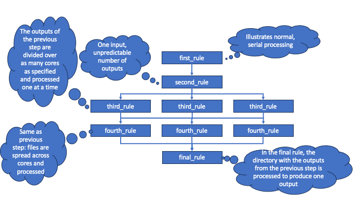
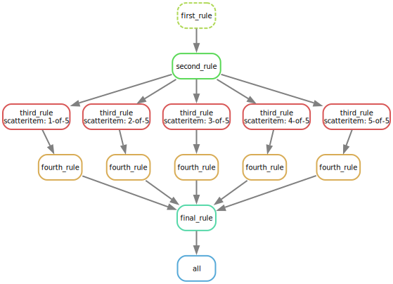

# snakemake-parallel-test

This repo contains a **not fully working** example of an attempt to parallelize parts
of a SnakeMake [pipeline](workflow/Snakefile). The intention is the following:

1. a rule `first_rule` with one input and one output
2. a rule `second_rule` that takes the output from `first_rule` as input and, in turn,
   produces a directory full of files as output
3. a rule `third_rule` in which the files in the output of 2. are processed, one at a 
   time, by a script that is run in parallel as many times as specified by the `-j 4`
   parameter. That script produces one output for its input.
4. a rule `fourth_rule` that continues with the output from 3, and which also invokes 
   a script that takes one input and produces one output, again in parallel
5. a rule `final_rule` that is invoked after rule 4. that takes the directory as input
   and that aggregates all outputs in that directory in a single operation, i.e. not
   parallel.

In the current implementation the following things work:

- multiple outputs are produced by `second_rule`
- the outputs are processed in parallel by `third_rule` and `fourth_rule`
- the multiple outputs are merged by `final_rule`
- a DAG figure is computed correctly, as shown below

The approach uses the [scatter/gather idiom](https://snakemake.readthedocs.io/en/stable/snakefiles/rules.html#defining-scatter-gather-processes).
It has a number of drawbacks:

- the intermediate rules that process in parallel cannot be invoked individually. Instead
  an error about `Target rules may not contain wildcards.` is triggered.
- the names of the intermediate files now have `{i}-of-{n}` parts in their name, which
  are hardcoded in the `{scatteritem}` variable by the scatter/gather functionality 
  (some string processing would fix this)
- the number of items to scatter needs to be predefined by `scattergather.split` in the
  Snakefile (can this be modified dynamically?)

